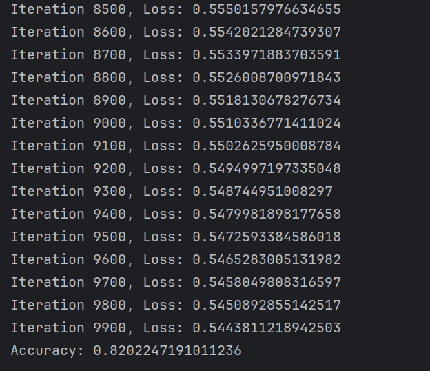

# 数据处理

## 缺失值处理

对于数据的缺失，由于cabin值缺失过多，且对生还概率影响不大，故直接删除。

embarked数据只缺失两个，所以我选的是用众数填补。

age的值缺失较多，我选择用均值填补。

另外删掉fare，ticket，parch，sibsp，name，passengerId等无关数据列。


## 数据归一化

由于数据是离散的，我选择归一化处理数据，在上面截图中已将sex，embarked进行归一化。

下面是将pclass，age归一化。


## OneHotEnconder还没做。。。

# 机器学习

## 代码

```python

import pandas as pd
import numpy as np

# 定义sigmoid函数
def sigmoid(z):
    return 1 / (1 + np.exp(-z))

# 定义损失函数
def loss_function(X, y, theta):
    m = len(y)
    h = sigmoid(np.dot(X, theta))
    loss = (-y * np.log(h) - (1 - y) * np.log(1 - h)).mean()
    return loss

def gradient_descent(X, y, theta, learning_rate, num_iterations):
    m = len(y)
    losses = []  # 用于存储每次迭代的损失值
    for i in range(num_iterations):
        h = sigmoid(np.dot(X, theta))
        gradient = np.dot(X.T, (h - y)) / m
        theta -= learning_rate * gradient

        # 每次迭代计算损失值并存储
        loss = loss_function(X, y, theta)
        losses.append(loss)

        if i % 100 == 0:
            print(f"Iteration {i}, Loss: {loss}")

    return theta, losses

# 初始化模型参数
def initialize_parameters(X):
    return np.zeros(X.shape[1])

# 定义预测函数
def predict(X, theta):
    h = sigmoid(np.dot(X, theta))
    predictions = np.round(h)
    return predictions

# 读取数据集并预处理
titanic_data = pd.read_csv('111.csv')
titanic_data.drop(['PassengerId', 'Name', 'Ticket', 'Cabin','SibSp','Parch','Fare'], axis=1, inplace=True)
titanic_data['Age'].fillna(titanic_data['Age'].mean(), inplace=True)
titanic_data['Embarked'] = titanic_data['Embarked'].fillna(titanic_data['Embarked'].mode()[0])
# print(titanic_data.head(10))

titanic_data['Sex'] = titanic_data['Sex'].map({'male': 0, 'female': 1})
titanic_data['Embarked'] = titanic_data['Embarked'].map({'S': 0, 'C': 0.5, 'Q': 1})
# Age列 归一化
Age = titanic_data['Age']
min_val = np.min(Age)
max_val = np.max(Age)
Age = (Age - min_val) / (max_val - min_val)
titanic_data['Age']=Age
# print(titanic_data)

# Pclass列 归一化
Pclass = titanic_data['Pclass']
min_val = np.min(Pclass)
max_val = np.max(Pclass)
# print(max_val)
Pclass = (Pclass - min_val) / (max_val - min_val)
titanic_data['Pclass']=Pclass
# print(titanic_data.head(10))


X = titanic_data.drop('Survived', axis=1)
X = np.concatenate((np.ones((X.shape[0], 1)), X), axis=1)
y = titanic_data['Survived']

# 划分训练集和测试集
np.random.seed(1)
indices = np.random.permutation(len(X))
X_train, X_test = X[indices[:-int(len(X)*0.2)]], X[indices[-int(len(X)*0.2):]]
y_train, y_test = y[indices[:-int(len(X)*0.2)]], y[indices[-int(len(X)*0.2):]]
X_train = np.concatenate((np.ones((X_train.shape[0], 1)), X_train), axis=1)
X_test = np.concatenate((np.ones((X_test.shape[0], 1)), X_test), axis=1)


# 初始化模型参数，使用的函数的长度正好就是x长加上1，对应w长加b
theta = initialize_parameters(X_train)

# 使用训练集进行训练
learning_rate = 0.001
num_iterations = 10000
theta,losses = gradient_descent(X_train, y_train, theta, learning_rate, num_iterations)

# 在测试集上进行预测
predictions = predict(X_test, theta)

# 计算准确率
accuracy = np.mean(predictions == y_test)
print('Accuracy:', accuracy)

```



## 不足

这个代码中对训练集和测试集的划分不是很好，我认为后续还可以优化。