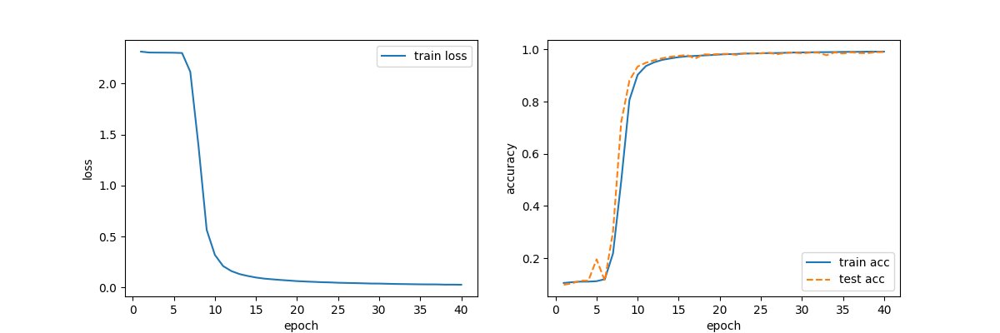

# Work of week2

## MLP

### 1. 实现单隐藏层MLP的正向传播和反向传播

选用一个隐藏层，15个隐藏单元，使用ReLU激活函数，优化器使用SGD，每个小批量大小为64，学习率为1，迭代次数为6。代码如 **MLP.py** 文件, 训练结果为loss = 0.4477, train acc = 0.8009, test acc = 0.8072.

### 2. 尝试防止过拟合的手段

在上面的尝试中并没有出现过拟合，不过我们可以往过拟合方向调整参数，看看会发生什么。

我们将迭代次数改为50次，loss = 0.4043, train acc = 0.8338, test acc = 0.8206, 结果上没有太大差异，但是过程中变化图像如下：

loss和acc在下降的过程中上下波动。我们把学习率下调到0.1，图像如下：

波动程度放缓，所以波动原因可能是每个小批量分布都有差异，而小批量梯度下降调整参数时幅度较大，导致整体的损失函数和精确度变化幅度大，出现类似的波动。

### 3. 尝试使用Adam优化器

我们将优化器换成Adam，同时降低学习率至lr = 0.01, 迭代次数增加至20，其余参数和上面保持不变即一个隐藏层，15个隐藏单元，使用ReLU激活函数，每个小批量大小为64。训练结果为loss = 0.4111， train acc = 0.8219, test acc = 0.8161, 图像如下

### 4. 尝试使用多种激活函数

1. 使用Sigmoid激活函数

   保持上述参数不变，将ReLU函数更换为Sigmoid函数，训练结果为loss = 0.4675, train acc = 0.7919, test acc = 0.7937, 图像如下

   

​	看到test acc曲线有一个峰值，我们降低迭代次数至10， 结果为loss = 	0.4877, train acc = 0.7814, test acc = 0.8206, 图像如下

​	

2. 使用Tanh 激活函数

   迭代次数还是为10，结果为loss = 0.4539, train acc = 0.8009, test acc = 0.8072, 图像如下

   

### 5. dropout 实现

代码见**MLP_dropout.py**文件，使用了两个隐藏层，并且增加了隐藏层的输出个数。(展现dropout对抗过拟合的功能)，选用2个隐藏层，第一层30个隐藏单元，第层20个隐藏单元，使用ReLU激活函数，优化器使用Adam，每个小批量大小为64，学习率为0.01，迭代次数为20。训练结果为loss = 0.4612, train acc = 0.8174, test acc = 0.8296。图像如下

## CNN

### 1. 实现CNN卷积神经网络

代码见**CNN.py**文件。使用mnist数据集，使用LeNet卷积神经网络，但是去掉了原始模型最后一层的高斯激活。优化器设为SGD，激活函数为, 损失函数为交叉熵损失函数，每批量大小256，迭代10次，学习率lr = 0.9。

训练结果为loss = 0.2211, train acc = 0.9329, test acc = 0.9259。图像如下

### 2. 尝试多种优化器、损失函数、激活函数

1. 将优化器改为Adam，学习率调整为lr = 0.01。其它参数不变。训练结果为loss = 0.0150, train acc = 0.9953, test acc = 0.9906。图像如下

   

2. 使用KL散度损失函数，使用Adam优化器，调整后的代码如**CNN_KL.py**。训练的模型见**model.py**中的train_model_CNN_KL函数。其他参数不变，训练结果为loss = 0.0168, train acc = 0.9946, test acc = 0.9899。 图像如下

   

3. 使用ReLU激活函数，使用Adam优化器，训练结果为loss = 0.0293, train acc = 0.9912, test acc = 0.9867。图像如下

   

### 3. 调整超参数使得模型识别的准确性更高

我们还是使用原有的LeNet卷积神经网络，使用Sigmoid激活函数，由上述过程可以看出，迭代次数选择10次时，优化器使用Adam(对应选择lr = 0.01)比SGD(对应选择lr = 0.9)的准确率更高，但是随着SGD优化器的***迭代次数增加，其准确率也随之上升***，但是也有一定限度，图中30次迭代后就已经出现过拟合的趋势，没有继续上升的趋势了。训练结果为loss = 0.0431, train acc = 0.9866, test acc = 0.9849, 图像如下

但是如果我们增加Adam的迭代次数至20，我们可以看到，准确率没有明显上升，结果为loss = 0.0110, train acc = 0.9964, test acc = 0.9867，甚至有点过拟合了，图像如下

我们还是回到SGD优化器来调整参数使得准确率上升。

在批量大小256， 学习率0.9， 循环次数设为25的基础上进行调整。该参数设置的训练结果为loss = 0.0470, train acc = 0.9858, test acc = 0.9860, 图像如下

我们尝试将批量大小调小至128，学习率调低至0.5，迭代次数升高至40次，训练结果为loss = 0.0270, train acc = 0.9920, test acc = 0.9904, 实现了99%以上的准确率。图像如下

经过调整多次尝试，SGD优化器的准确率基本都在99%左右，很难再往上有突破。

## 大模型部署

在服务器部署Qwen-chat 1.8B模型，并完成简单的对话。

租用了3090，在服务器进行了简单的部署，截屏如下

下面是一个交互式demo

